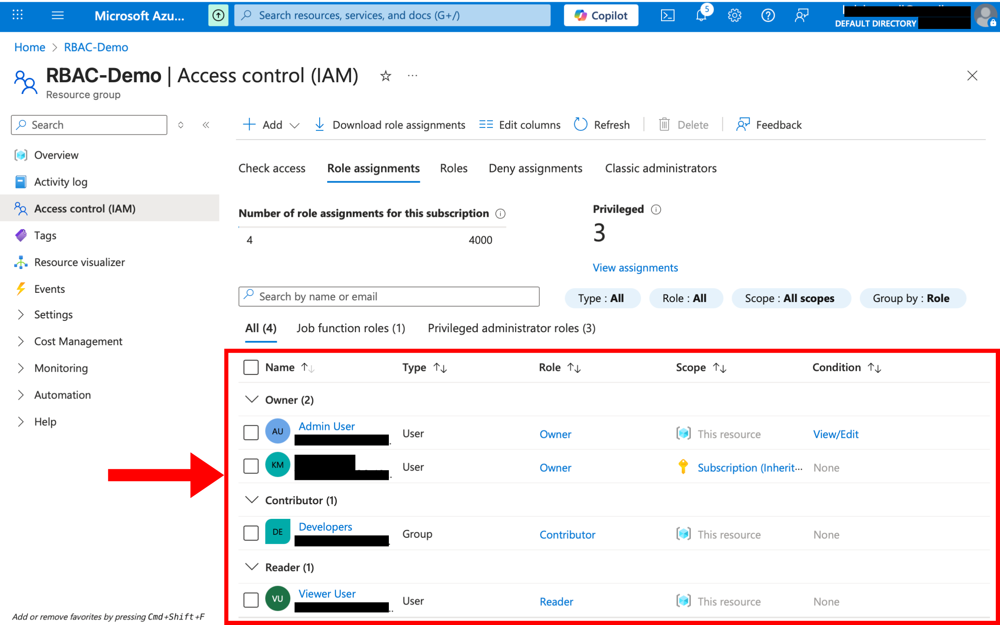
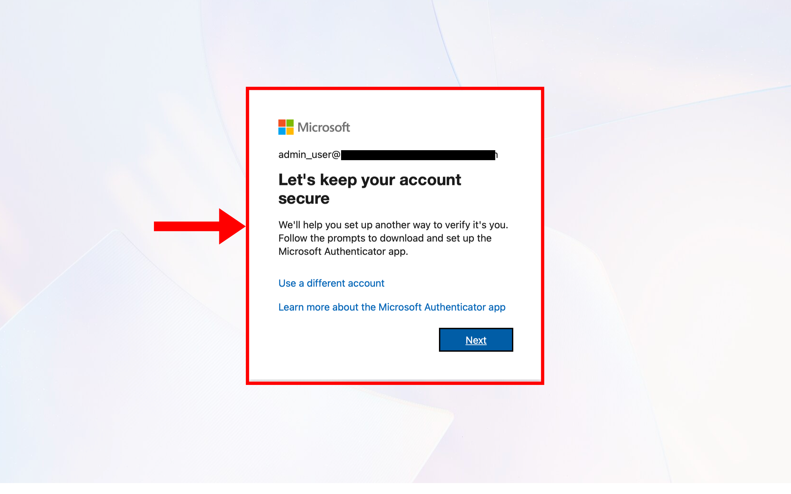
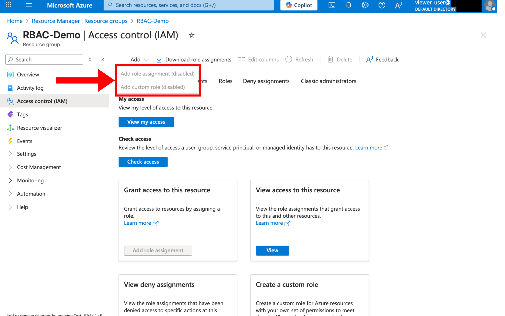
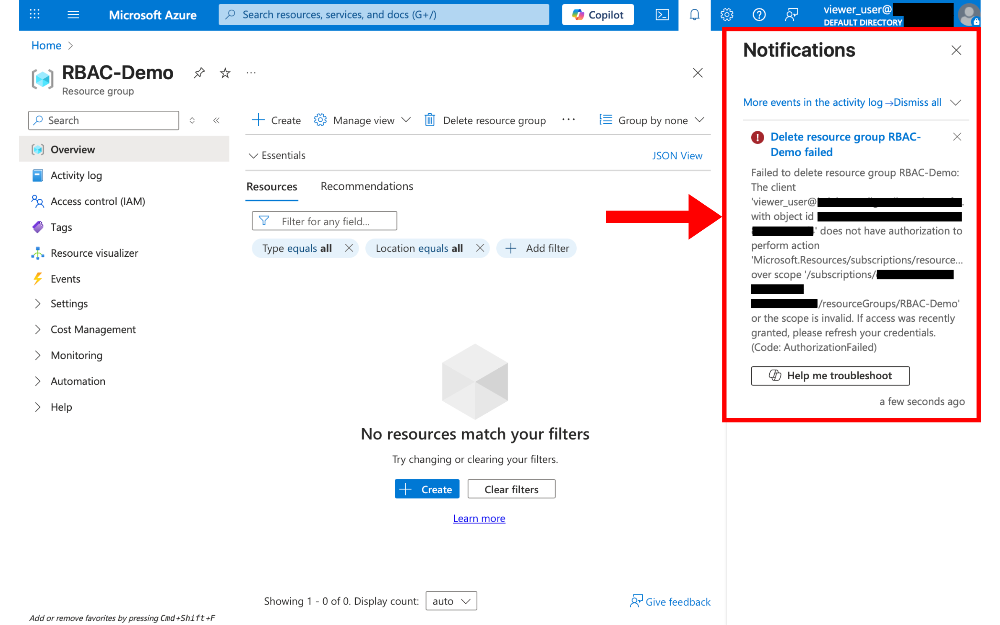
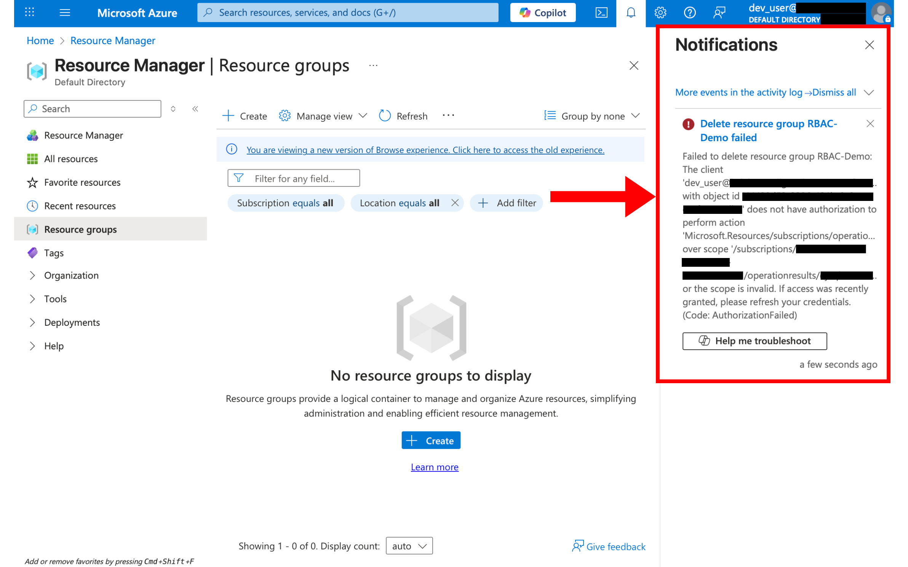
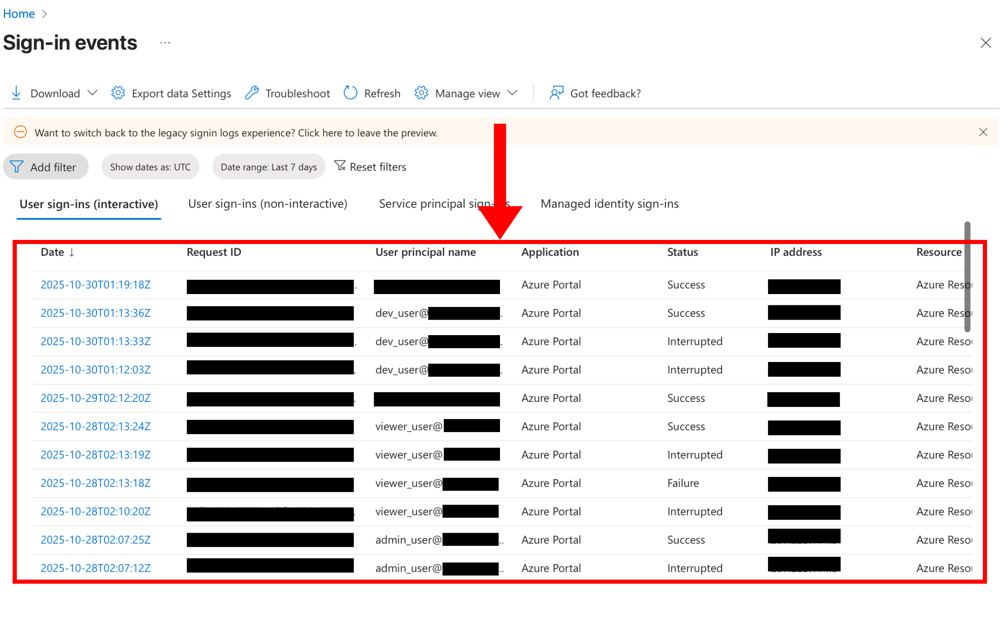

# Microsoft Azure RBAC (IAM) Role-Based Access Control Lab

## Overview
This project demonstrates how to configure **Role-Based Access Control (RBAC)** in Microsoft Azure using **Identity and Access Management (IAM)**.  
The goal was to assign and verify different access levels for users within a resource group while enforcing **security defaults** and **Multi-Factor Authentication (MFA)**.

---

## Setup

### 1. Created three Azure AD users
- **Admin** – Assigned the **Owner** role  
- **Dev** – Assigned the **Contributor** role  
- **Viewer** – Assigned the **Reader** role  

### 2. Created a resource group
- Resource group name: `RBAC-Demo`

### 3. Created and configured a group
- Group name: **Developers**  
- Added the **Dev** user to this group  
- Assigned the **Contributor** role to the **Developers** group at the resource group level  

### 4. Role assignments were made through
**Azure Portal → Resource Group → Access Control (IAM) → Add Role Assignment**

---

## Security Configuration
- **Multi-Factor Authentication (MFA)** was enforced using Azure’s **default security settings**.  
- Verified that each user was prompted to set up or complete MFA during their first login.

---

## Testing and Verification

### Test Objective
To confirm that RBAC roles restrict users according to the **principle of least privilege**, and that **MFA enforcement** is active for all accounts.

### Tests Performed
- **Viewer (Reader role)** attempted to:
  - Delete the resource group → **Access denied**  
  - Add or modify role assignments → **Access denied**
- **Developer (Contributor role)** attempted to:
  - Delete the resource group → **Access denied**  
  - Modify or create resources → (Not tested to avoid costs, but permissions verified in IAM)
- Verified that all users received an **MFA prompt** upon first login.

### Results
- Both the **Viewer** and **Developer** users were correctly restricted from deleting the resource group or modifying IAM roles, confirming that RBAC permissions were applied as intended.  
- MFA prompts appeared for all users, confirming that **Azure Security Defaults** were successfully enforced.  
- No resources were created to avoid incurring Azure costs.

### Additional Verification
- Checked **Sign-in Logs** in Azure Active Directory to verify successful login activity for each user.

---

## Screenshots
All screenshots are stored in the `screenshots` folder in this repository.  

1. **IAM Role Assignments** page showing Owner, Contributor, and Reader roles  
     

2. **MFA prompt during login**  
     

3. **“Access denied” message** when Viewer and Developer attempted restricted actions
   
    
     

4. **Sign-in logs** from Azure AD  
     

---

## Tools & Services Used
- Microsoft Azure Portal  
- Azure Active Directory (Entra ID)  
- Azure IAM (RBAC)  
- Azure Sign-in Logs  
- MFA Security Defaults

---

## Learning Outcomes
- Configured and verified **Role-Based Access Control (RBAC)**  
- Applied the **Principle of Least Privilege** to user roles  
- Enforced and confirmed **MFA** with Azure Security Defaults  
- Monitored and audited activity using **Azure Sign-in Logs**

---

## Author
**Kaleb Maull**  
[LinkedIn](https://linkedin.com/in/kalebamaull)  
[GitHub](https://github.com/KMaullboy)

